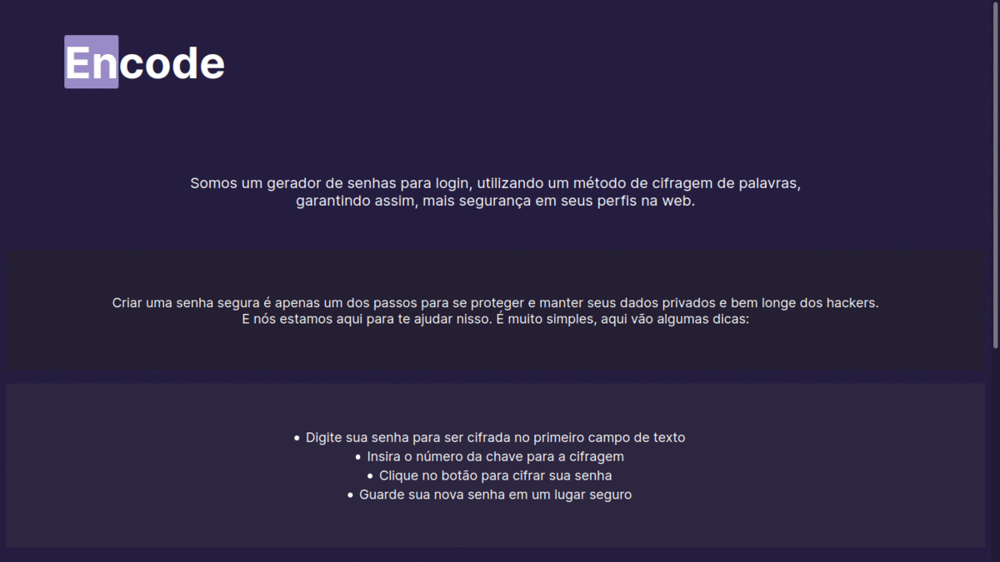

## Índice

* [Sobre](#Encode)
* [Resumo do projeto](#Projeto)
* [Layout](#Layout)
* [Instruções](#Instruções)
* [Tecnologias utilizadas](#Tecnologias)
***

# Encode

O Encode é um gerador de senhas para login, buscando fornecer mais segurança e praticidade para os internautas na web e em suas redes sociais.

Criar uma senha segura é apenas um dos passos para se proteger e manter seus dados privados. E o Encode está aqui para te ajudar nisso. Utilizamos um método de criptografia de caracteres onde suas senhas se tornam muito mais seguras.

## Projeto
A Cifra de César é um tipo de cifra por substituição, em que cada letra do texto original é substituída por outra que se encontra há um número fixo de posições (deslocamento) mais a frente do mesmo alfabeto. O usuário desta aplicação poderá cifrar e decifrar um texto indicando a chave de deslocamento (offset). 

Aplicação web desenvolvida durante o bootcamp da Laboratória.

## Layout
O processo de criação foi pensado buscando simplicidade e praticidade para o usuário da aplicação, onde ele pudesse de maneira rápida criar uma nova senha utilizando a cifra.

## Instruções

Para criar uma nova senha criptografada, o usuário deve inserir caracteres na primeira caixa de texto, onde sua senha está decifrada.
Deve então escolher um número como chave de deslocamento.
E então clicar no botão para cifrar sua senha.

#### Caracteres aceitos
- Letras maiúsculas

### Chave de deslocamento
- Números positivos

## Tecnologias
- Javascript
- CSS3
- HTML5

